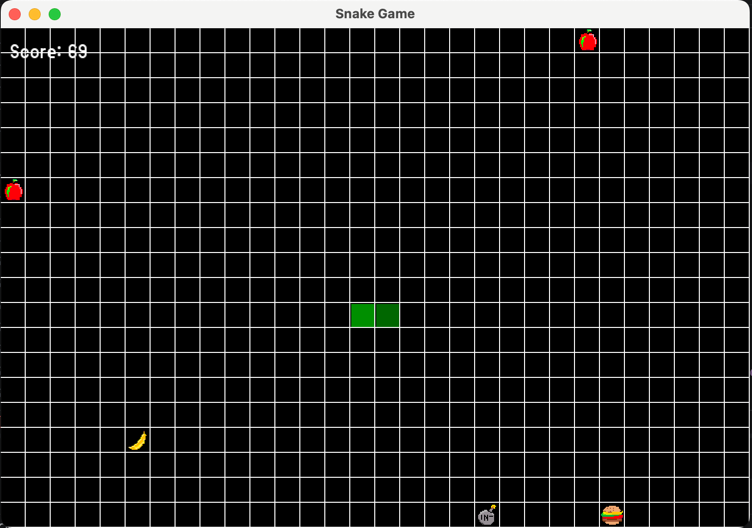
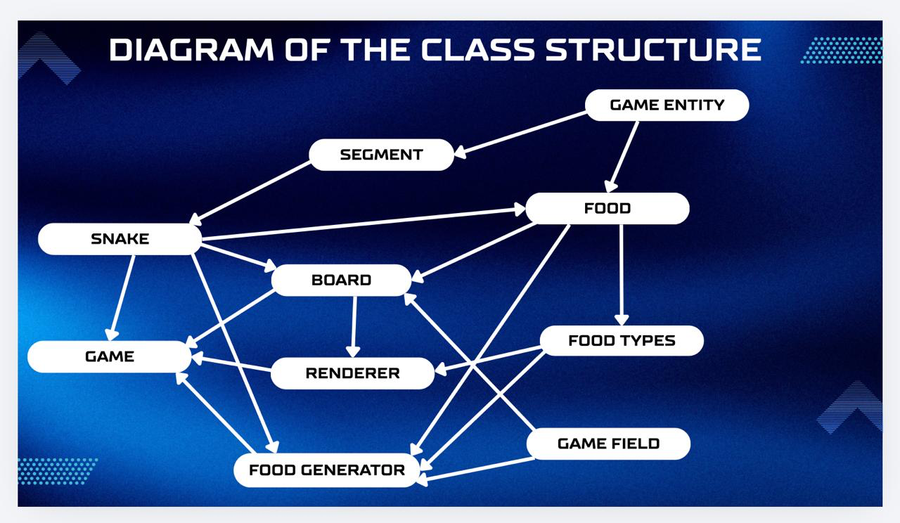
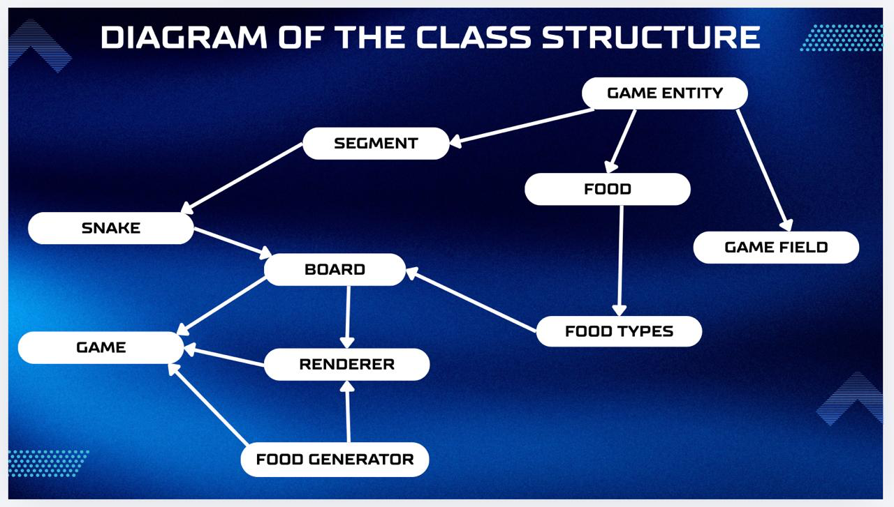

# A modern c++ implementation of the classic Snake Game.
_With a delicious twist - real food products like bananas, burgers, rotten apples and even bombs. Each food item has a special unique effect on the snake._

## Game Preview


## The Food Product Twist
* **Food** - something that makes our game different from others.
* **Banana** - grows snake by 1 cell (+1 point)
* **Hamburger** - grows snake by 2 cells (+2 points)
* **Poison Apple** - reduces snake by 1 cell (-1 point)
* **Bomb** - instantly kills the snake (-3 points)

## Features
* 4 Unique Food Types - each has it's own texture and gameplay effects.
* Smart Food Generation - each food type can spawn anywhere of the field, except of the place where the snake stands. There can be maximum 5 elements, there could be ONLY one Bomb.
* Score System - with each meal of the snake a player can track the amount of points.
* Game Over Screen - shows that the snake is dead, the game is over and final score of the player.
* Control - player can play using arrow keys or WASD.

## Project Structure
HSE_project_snake/<br>
|-- assets/<br>
|&nbsp;&nbsp;&nbsp;&nbsp;|--APPLE.png<br>
|&nbsp;&nbsp;&nbsp;&nbsp;|--BANANA.png<br>
|&nbsp;&nbsp;&nbsp;&nbsp;|--BOMB.png<br>
|&nbsp;&nbsp;&nbsp;&nbsp;|--BURGER.png<br>
|&nbsp;&nbsp;&nbsp;&nbsp;|--arial.ttf<br>
|--include/<br>
|&nbsp;&nbsp;&nbsp;&nbsp;|--Board.h<br>
|&nbsp;&nbsp;&nbsp;&nbsp;|--Food.h<br>
|&nbsp;&nbsp;&nbsp;&nbsp;|--FoodGenerator.h<br>
|&nbsp;&nbsp;&nbsp;&nbsp;|--FoodTypes.h<br>
|&nbsp;&nbsp;&nbsp;&nbsp;|--Game.h<br>
|&nbsp;&nbsp;&nbsp;&nbsp;|--GameEntity.h<br>
|&nbsp;&nbsp;&nbsp;&nbsp;|--GameField.h<br>
|&nbsp;&nbsp;&nbsp;&nbsp;|--Renderer.h<br>
|&nbsp;&nbsp;&nbsp;&nbsp;|--Segment.h<br>
|&nbsp;&nbsp;&nbsp;&nbsp;|--Snake.h<br>
|--src/<br>
|&nbsp;&nbsp;&nbsp;&nbsp;|--Board.cpp<br>
|&nbsp;&nbsp;&nbsp;&nbsp;|--Food.cpp<br>
|&nbsp;&nbsp;&nbsp;&nbsp;|--FoodGenerator.cpp<br>
|&nbsp;&nbsp;&nbsp;&nbsp;|--FoodTypes.cpp<br>
|&nbsp;&nbsp;&nbsp;&nbsp;|--Game.cpp<br>
|&nbsp;&nbsp;&nbsp;&nbsp;|--GameEntity.cpp<br>
|&nbsp;&nbsp;&nbsp;&nbsp;|--GameField.cpp<br>
|&nbsp;&nbsp;&nbsp;&nbsp;|--Renderer.cpp<br>
|&nbsp;&nbsp;&nbsp;&nbsp;|--Segment.cpp<br>
|&nbsp;&nbsp;&nbsp;&nbsp;|--Snake.cpp<br>
|&nbsp;&nbsp;&nbsp;&nbsp;|--main.cpp<br>
|--tests/<br>
|&nbsp;&nbsp;&nbsp;&nbsp;|--test_board.cpp<br>
|&nbsp;&nbsp;&nbsp;&nbsp;|--test_food.cpp<br>
|&nbsp;&nbsp;&nbsp;&nbsp;|--test_foodgenerator.cpp<br>
|&nbsp;&nbsp;&nbsp;&nbsp;|--test_game_entity.cpp<br>
|&nbsp;&nbsp;&nbsp;&nbsp;|--test_main.cpp<br>
|&nbsp;&nbsp;&nbsp;&nbsp;|--test_renderer.cpp<br>
|&nbsp;&nbsp;&nbsp;&nbsp;|--test_segment.cpp<br>
|&nbsp;&nbsp;&nbsp;&nbsp;|--test_snake.cpp<br>
|--CMakeLists.txt/<br>
|--README.md/<br>
|--.gitignore/<br>

## Class Overview

* **_Game_** : 
  * &nbsp;&nbsp;&nbsp;&nbsp; creates and manages the game board, food generator and renderer<br>
  * &nbsp;&nbsp;&nbsp;&nbsp; keyboard controls<br>
  * &nbsp;&nbsp;&nbsp;&nbsp; runs the main game loop<br>
  * &nbsp;&nbsp;&nbsp;&nbsp; initializes the board with 5 food elements<br>

* **_Board_** :
    * &nbsp;&nbsp;&nbsp;&nbsp; inherits from GameField to get width and height of the window<br>
    * &nbsp;&nbsp;&nbsp;&nbsp; contains a snake and a vector with different food types<br>
    * &nbsp;&nbsp;&nbsp;&nbsp; updates game state each frame<br>
    * &nbsp;&nbsp;&nbsp;&nbsp; applies effects of the food on the snake and adds/removes points to the score, when it eats<br>

* **_Snake_** :
    * &nbsp;&nbsp;&nbsp;&nbsp; uses std::deque<std::unique_ptr<Segment>> for storing parts of snake's body<br>
    * &nbsp;&nbsp;&nbsp;&nbsp; moves the snake - up, down, left, right<br>
    * &nbsp;&nbsp;&nbsp;&nbsp; can grow, shrink and die - depends on the food it ate<br>
    * &nbsp;&nbsp;&nbsp;&nbsp; checks collisions with itself and with food items<br>

* **_Food_** :
    * &nbsp;&nbsp;&nbsp;&nbsp; inherits from GameEntity<br>
    * &nbsp;&nbsp;&nbsp;&nbsp; defines pure virtual methods: getPoints() - returns point value, applyEffect(Snake&) - applies effect on the snake<br>

* **_FoodTypes_** :
    * &nbsp;&nbsp;&nbsp;&nbsp; uses enum class Type(for different food types)<br>
    * &nbsp;&nbsp;&nbsp;&nbsp; each type gives different effects: banana - grows by 1 cell, hamburger - grows by 2 cells, poison apple - reduces on 1 cell, bomb - kills<br>
    * &nbsp;&nbsp;&nbsp;&nbsp; each type gives different score points: banana - +1, hamburger - +2, poison apple - -1, bomb - -3(makes score negative in any case)<br>

* **_FoodGenerator_** :
    * &nbsp;&nbsp;&nbsp;&nbsp; first 3 foods in the beginning of the game are always 2 poison apples and 1 bomb, number of bananas or hamburger may differ form 0 to 2<br>
    * &nbsp;&nbsp;&nbsp;&nbsp; tracks number of bombs - there could be only one bomb on the field<br>
    * &nbsp;&nbsp;&nbsp;&nbsp; adjust spawn probabilities based on recent history<br>
    * &nbsp;&nbsp;&nbsp;&nbsp; ensures food never spawns where snake is<br>

* **_Renderer_** :
    * &nbsp;&nbsp;&nbsp;&nbsp; draws white grid for the board<br>
    * &nbsp;&nbsp;&nbsp;&nbsp; sets the color for the snake: head - dark green, body - light green<br>
    * &nbsp;&nbsp;&nbsp;&nbsp; uses png images to set textures on the board for each food type<br>
    * &nbsp;&nbsp;&nbsp;&nbsp; displays current score and "Game Over" screen<br>
    * &nbsp;&nbsp;&nbsp;&nbsp; manages the game window end events<br>

* **_GameEntity_** :
    * &nbsp;&nbsp;&nbsp;&nbsp; stores X and Y coordinates<br>
    * &nbsp;&nbsp;&nbsp;&nbsp; provides getters and setters for position on the board<br>
    * &nbsp;&nbsp;&nbsp;&nbsp; have a pure virtual method getSymbol() for debugging<br>

* **_Segment_** :
  * &nbsp;&nbsp;&nbsp;&nbsp; represents a single part of the snake's body<br>
  * &nbsp;&nbsp;&nbsp;&nbsp; inherits form GameEntity<br>
  * &nbsp;&nbsp;&nbsp;&nbsp; overrides getSymbol()<br>

* **_GameField_** :
  * &nbsp;&nbsp;&nbsp;&nbsp; stores width and height for the board<br>
  * &nbsp;&nbsp;&nbsp;&nbsp; provides pure virtual methods GetWidth() and GetHeight()<br>
  * &nbsp;&nbsp;&nbsp;&nbsp; inherited by Board and FoodGenerator<br>

## Class Relationships


## Used Modern C++ Features
* **_std:unique_ptr: we used it because it perfectly suited for polymorphic objects(ex: FoodTypes inherits from Food) and ensures single ownership with automatic cleanup._**
  * &nbsp;&nbsp;&nbsp;&nbsp; in Snake class: std::deque<std::unique_ptr<Segment>> body;
  * &nbsp;&nbsp;&nbsp;&nbsp; in Board class: std::unique_ptr<Snake> snake; &nbsp; std::vector<std::unique_ptr<Food>> food;
  * &nbsp;&nbsp;&nbsp;&nbsp; in FoodGenerator class: return std::make_unique<FoodTypes>(x, y, foodType);

* **_RAII: we used it because all resources (memory, window, textures, font) are automatically cleaned up, when objects go out of scope._**
  * &nbsp;&nbsp;&nbsp;&nbsp; smart pointers manage memory automatically: std::unique_ptr<Snake> snake;
  * &nbsp;&nbsp;&nbsp;&nbsp; SFML objects manage their own resources: sf::RenderWindow window, sf::Texture bananaTex, sf::Font font;
  * &nbsp;&nbsp;&nbsp;&nbsp; we have no manual new/delete in our code at all;

* **_constexpr: we used it because compile time constants for better performance and code clarity._**
  * &nbsp;&nbsp;&nbsp;&nbsp; in FoodTypes.h : static constexpr int FOOD_TYPE_COUNT = 4;
  * &nbsp;&nbsp;&nbsp;&nbsp; in FoodTypes.cpp : constexpr int BANANA_POINTS = 1;
  * &nbsp;&nbsp;&nbsp;&nbsp; in Game.cpp : constexpr int frameDelay = 200;

* **_std::optional: we used it in method FoodGenerator::generate() to handle the case when no free space is available for the new food to appear._**
  * &nbsp;&nbsp;&nbsp;&nbsp; safety: if we would use just usual check with if and while(true) the we could have problems with the loop which would run forever trying to find extra space for new food to appear;
  * &nbsp;&nbsp;&nbsp;&nbsp; clarity: with usual check there would be no way to tell the caller that food could not be generated;
```
std::optional<std::unique_ptr<Food>> FoodGenerator::generate(const Snake& snake) {
    const int maxAttempts = 1000;
    int attempts = 0;

    while (attempts < maxAttempts) {
        auto food = generateRandomFood();
        if (!snake.collidesWith(food->getX(), food->getY())) {
            return std::move(food);
        }
        attempts++;
    }

    return std::nullopt;
}
```

* **_exceptions(try/catch/throw): we used it to have a proper error handling without crashing the program._**
  * &nbsp;&nbsp;&nbsp;&nbsp; in Board class: a board should ALWAYS have a snake - otherwise there should be a mistake(UB).
```
Snake& Board::getSnake() const {
  if (!snake) {
    throw std::runtime_error("SNAKE IS EMPTY");
  }
  return *snake;
}
```
  * &nbsp;&nbsp;&nbsp;&nbsp; in main.cpp: it trys to start the game - if fails then shows an error message istead of just crashing, it gives no resources leakages as it destroys all objects properly
```
    try
    {
        Game game(30, 20);
        game.run();
    }

    catch (const std::exception& e)
    {
        std::cerr << "Error: " << e.what() << std::endl;
        return 1;
    }
```

## Build System - CMake
* Requires CMake 3.20 or higher
* C++ standard is C++23

**In CMake automatically made:**
* Downloads SFML: gets the graphics library
* Downloads GoogleTest: gets the testing framework
* Copies font files: puts .ttf files next to the game executable
* Builds the game: compiles all src files
* Builds tests: creates a separate test executable

**Two Build Targets**
1. Snake - main game: 
   * &nbsp;&nbsp;&nbsp;&nbsp; compiles all source file from src/ directory
   * &nbsp;&nbsp;&nbsp;&nbsp; includes headers from include/ directory
   * &nbsp;&nbsp;&nbsp;&nbsp; links against SFML graphics, window, and system libraries
   * &nbsp;&nbsp;&nbsp;&nbsp; automatically copies font files (.ttf) from assets/ to build directory

2. SNAKEGAME_TESTS - runs all tests:
   * &nbsp;&nbsp;&nbsp;&nbsp; builds all test files from tests/ directory
   * &nbsp;&nbsp;&nbsp;&nbsp; excludes main.cpp to prevent duplicate entry points
   * &nbsp;&nbsp;&nbsp;&nbsp; links against GoogleTest and SFML libraries
   * &nbsp;&nbsp;&nbsp;&nbsp; automatically discovers and registers tests with CTest


**Special flags for macOS-specific compiler flags**
```
if(APPLE)
set(CMAKE_CXX_FLAGS "${CMAKE_CXX_FLAGS} -D_LIBCPP_DISABLE_AVAILABILITY")
endif()
```

**Automatic Dependency Management**
Our project uses CMake's FetchContent module to automatically download and build SFML and GoogleTest


## Google Tests
_Every class has its own test to check every method and find different mistakes and problems. In summary we have 61 tests. They check the initialisation, methods, summ and etc. As for renderer.h it also opens new windows and draw small field with snake. All classes our passed test successfully._
